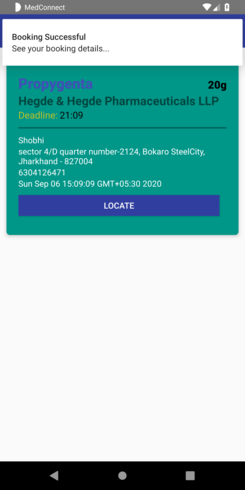
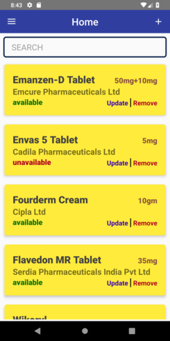
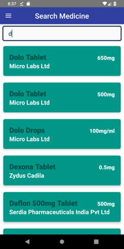
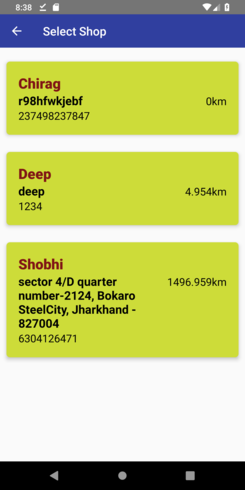
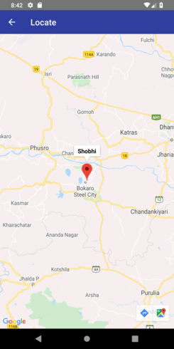

# MedConnect

A medicine search app for providing an ease of locating nearby medicine shops and medicine availibility.

MedConnect is currently under heavy development. Note that some changes (such as database schema modifications) are not backwards compatible and may cause the app to crash. In this case, please uninstall and re-install the app.

## Installation
Clone this repository and import into **Android Studio**
```bash
git clone https://github.com/shobhi1310/MedConnect.git
```
The App is communicating with a custom made [*API*](http://glacial-caverns-39108.herokuapp.com/), the documentation of which is available [*here*](https://github.com/shobhi1310/medcon_server)

## App features
As of now the app performs the following features:
1. A customer can search for the medicine and get the corresponding nearby medicine stores in his/her city, see the location in map and also book it for a specified period of time.
2. The customer can look into his/her current bookings and also locate the shops on map.
3. A shopkeeper can update the respective shop inventory by searching those medicines.
4. The shopkeeper can also look into the current bookings within a given deadline with the necessary details of medicine and customer. 
5. Booking history has been provided both for **shopkeeper** and **customer**.

*For more information, please refer to the [wiki](http://github.com/shobhi1310/MedConnect/wiki)*

Screenshots
-----------







## App info
* target SDK 29
* release version v 1.0.0

## Maintainers
This project is mantained by:
* [Shubhankar Bhadra](http://github.com/shobhi1310)
* [Tapish Ojha](http://github.com/tapish2000)
* [Mir Sameed Ali](http://github.com/mir-sam-ali)
* [Rohit Shakya](http://github.com/rohit-cs18b029)
* [Chirag Gupta](http://github.com/chirag2706)

## Contributing

1. Fork it
2. Create your feature branch (git checkout -b my-new-feature)
3. Commit your changes (git commit -m 'Add some feature')
4. Push your branch (git push origin my-new-feature)
5. Create a new Pull Request
